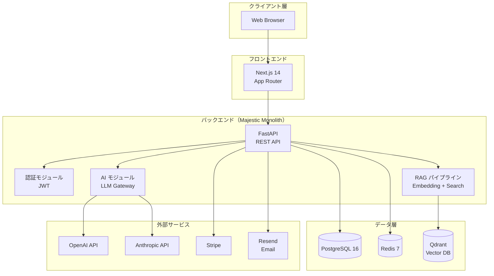
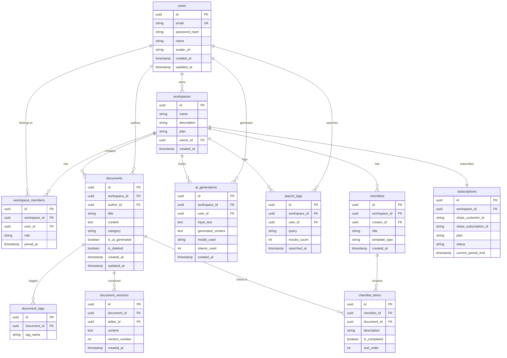
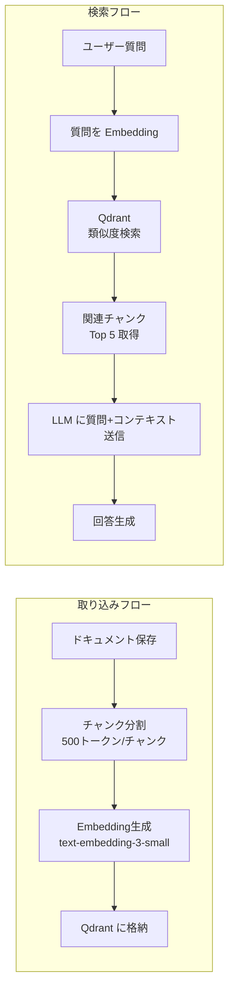

# Phase 3: 設計書

**プロジェクト**: TsugiNote（ツギノート）
**作成日**: 2026-03-29
**設計原則**: Majestic Monolith / 1人運用最適化

---

## 1. アーキテクチャ概要



---

## 2. 技術スタック

### 技術スタック選定

| レイヤー | 技術 | 選定理由 |
|---------|------|---------|
| **言語（Backend）** | Python 3.12+ | LLM/AI ライブラリの充実、FastAPIとの親和性 |
| **Framework（Backend）** | FastAPI | 非同期対応、自動APIドキュメント、Pydanticバリデーション |
| **言語（Frontend）** | TypeScript | 型安全性、開発生産性 |
| **Framework（Frontend）** | Next.js 14 (App Router) | SSR/SSG、SEO、Vercelデプロイ最適 |
| **UI** | Tailwind CSS + shadcn/ui | 高速UI開発、カスタマイズ性 |
| **DB** | PostgreSQL 16 | 信頼性、全文検索、JSON対応 |
| **Cache** | Redis 7 | セッション、レート制限、キャッシュ |
| **Vector DB** | Qdrant | OSS、Python SDK充実、セルフホスト可能 |
| **ORM** | SQLAlchemy 2.0 + Alembic | 型安全ORM、マイグレーション管理 |
| **認証** | JWT (PyJWT) | ステートレス、スケーラブル |
| **AI** | OpenAI API + Anthropic API | マルチプロバイダー対応で可用性確保 |
| **決済** | Stripe | 開発者体験最良、日本対応 |
| **Email** | Resend | シンプルAPI、低コスト |
| **Hosting（Frontend）** | Vercel | Next.js最適化、自動デプロイ |
| **Hosting（Backend）** | Railway or Fly.io | Docker対応、自動スケール、低コスト |
| **CI/CD** | GitHub Actions | 無料枠十分、自動テスト・デプロイ |
| **監視** | Sentry + Better Uptime | エラー追跡、死活監視 |

### 技術スタック将来性マトリクス

| 技術要素 | 成熟度 | コミュニティ | LTS/サポート | 陳腐化リスク | 移行先候補 |
|---------|--------|------------|-------------|------------|-----------|
| Python | 成熟期 | 活発 | 5年+ | 低 | — |
| FastAPI | 成長期 | 活発 | 継続的 | 低 | Litestar |
| Next.js | 成長期 | 活発 | Vercel支援 | 低 | Remix/Astro |
| PostgreSQL | 成熟期 | 活発 | 5年+ | 低 | — |
| Qdrant | 成長期 | 活発 | 継続的 | 中 | Pinecone/Weaviate |
| Tailwind CSS | 成熟期 | 活発 | 継続的 | 低 | — |

### ベンダーロックイン評価

| レイヤー | ロックイン度 | 脱却コスト | 代替サービス |
|---------|-----------|-----------|------------|
| Vercel (Frontend) | 低 | 2人日 | Cloudflare Pages, Netlify |
| Railway (Backend) | 低 | 3人日 | Fly.io, Render, AWS ECS |
| OpenAI API | 低 | 1人日 | Anthropic, ローカルLLM |
| Stripe | 中 | 5人日 | Paddle, LemonSqueezy |
| Qdrant | 低 | 3人日 | Pinecone, Weaviate, pgvector |

---

## 3. データベース設計（ER図）



---

## 4. API設計

### 認証

```
POST   /api/v1/auth/signup          # サインアップ
POST   /api/v1/auth/login           # ログイン
POST   /api/v1/auth/logout          # ログアウト
POST   /api/v1/auth/refresh         # トークン更新
POST   /api/v1/auth/reset-password  # パスワードリセット
GET    /api/v1/auth/me              # プロフィール取得
PUT    /api/v1/auth/me              # プロフィール更新
```

### ワークスペース

```
POST   /api/v1/workspaces                      # 作成
GET    /api/v1/workspaces                      # 一覧
GET    /api/v1/workspaces/{id}                 # 詳細
PUT    /api/v1/workspaces/{id}                 # 更新
POST   /api/v1/workspaces/{id}/invite          # メンバー招待
GET    /api/v1/workspaces/{id}/members         # メンバー一覧
DELETE /api/v1/workspaces/{id}/members/{uid}   # メンバー削除
```

### ドキュメント

```
POST   /api/v1/workspaces/{wid}/documents          # 作成
GET    /api/v1/workspaces/{wid}/documents          # 一覧
GET    /api/v1/workspaces/{wid}/documents/{id}     # 詳細
PUT    /api/v1/workspaces/{wid}/documents/{id}     # 更新
DELETE /api/v1/workspaces/{wid}/documents/{id}     # 削除（ソフト）
GET    /api/v1/workspaces/{wid}/documents/{id}/versions  # 変更履歴
```

### AI機能

```
POST   /api/v1/workspaces/{wid}/ai/generate        # ドキュメント自動生成
POST   /api/v1/workspaces/{wid}/ai/search           # セマンティック検索
POST   /api/v1/workspaces/{wid}/ai/ask               # Q&A
GET    /api/v1/workspaces/{wid}/ai/usage             # 利用状況
```

### チェックリスト

```
POST   /api/v1/workspaces/{wid}/checklists          # 作成
GET    /api/v1/workspaces/{wid}/checklists          # 一覧
GET    /api/v1/workspaces/{wid}/checklists/{id}     # 詳細
PUT    /api/v1/workspaces/{wid}/checklists/{id}     # 更新
PUT    /api/v1/workspaces/{wid}/checklists/{id}/items/{iid}  # アイテム更新
```

### 決済

```
POST   /api/v1/billing/checkout          # Stripe Checkout セッション作成
POST   /api/v1/billing/portal            # Stripe Customer Portal
POST   /api/v1/billing/webhook           # Stripe Webhook
GET    /api/v1/billing/subscription      # サブスク情報
```

### ダッシュボード

```
GET    /api/v1/workspaces/{wid}/dashboard/stats      # 統計情報
GET    /api/v1/workspaces/{wid}/dashboard/recent      # 最近のアクティビティ
```

---

## 5. フロントエンド画面設計

### 画面一覧

| 画面 | パス | 認証 |
|------|------|------|
| ランディングページ | `/` | 不要 |
| 料金ページ | `/pricing` | 不要 |
| サインアップ | `/signup` | 不要 |
| ログイン | `/login` | 不要 |
| ダッシュボード | `/dashboard` | 必要 |
| ドキュメント一覧 | `/documents` | 必要 |
| ドキュメント詳細/編集 | `/documents/[id]` | 必要 |
| AI生成 | `/ai/generate` | 必要 |
| ナレッジ検索 | `/search` | 必要 |
| チェックリスト一覧 | `/checklists` | 必要 |
| チェックリスト詳細 | `/checklists/[id]` | 必要 |
| メンバー管理 | `/settings/members` | 必要（オーナー） |
| プラン・請求 | `/settings/billing` | 必要（オーナー） |
| プロフィール | `/settings/profile` | 必要 |

---

## 6. ディレクトリ構成

```
tsuginote/
├── src/
│   ├── backend/                     # FastAPI バックエンド
│   │   ├── app/
│   │   │   ├── api/
│   │   │   │   ├── v1/
│   │   │   │   │   ├── auth.py
│   │   │   │   │   ├── workspaces.py
│   │   │   │   │   ├── documents.py
│   │   │   │   │   ├── ai.py
│   │   │   │   │   ├── checklists.py
│   │   │   │   │   ├── billing.py
│   │   │   │   │   └── dashboard.py
│   │   │   │   └── deps.py          # 共通依存性
│   │   │   ├── core/
│   │   │   │   ├── config.py         # 設定管理
│   │   │   │   ├── security.py       # JWT / パスワード
│   │   │   │   └── database.py       # DB接続
│   │   │   ├── models/               # SQLAlchemy モデル
│   │   │   │   ├── user.py
│   │   │   │   ├── workspace.py
│   │   │   │   ├── document.py
│   │   │   │   ├── checklist.py
│   │   │   │   └── subscription.py
│   │   │   ├── schemas/              # Pydantic スキーマ
│   │   │   ├── services/             # ビジネスロジック
│   │   │   │   ├── ai_service.py     # LLM Gateway
│   │   │   │   ├── rag_service.py    # RAG パイプライン
│   │   │   │   ├── billing_service.py
│   │   │   │   └── email_service.py
│   │   │   └── main.py
│   │   ├── alembic/                  # マイグレーション
│   │   ├── pyproject.toml
│   │   └── Dockerfile
│   │
│   └── frontend/                    # Next.js フロントエンド
│       ├── app/
│       │   ├── (public)/            # 認証不要ページ
│       │   │   ├── page.tsx         # LP
│       │   │   ├── pricing/
│       │   │   ├── login/
│       │   │   └── signup/
│       │   ├── (protected)/         # 認証必要ページ
│       │   │   ├── dashboard/
│       │   │   ├── documents/
│       │   │   ├── ai/
│       │   │   ├── search/
│       │   │   ├── checklists/
│       │   │   └── settings/
│       │   └── layout.tsx
│       ├── components/
│       │   ├── ui/                  # shadcn/ui
│       │   ├── documents/
│       │   ├── ai/
│       │   └── layout/
│       ├── lib/
│       │   ├── api.ts               # API クライアント
│       │   ├── auth.ts              # 認証ユーティリティ
│       │   └── utils.ts
│       ├── package.json
│       ├── tailwind.config.ts
│       ├── tsconfig.json
│       └── Dockerfile
│
├── infra/
│   ├── docker/
│   │   └── docker-compose.yml       # ローカル開発
│   └── ci/
│       └── deploy.yml               # GitHub Actions
│
├── docs/                            # 成果物ドキュメント
├── test/                            # E2Eテスト
├── security/                        # セキュリティ監査
├── ops/                             # 運用ドキュメント
├── .env.example
├── .gitignore
└── README.md
```

---

## 7. RAGパイプライン設計



### Embedding 戦略

| パラメータ | 値 |
|-----------|-----|
| モデル | `text-embedding-3-small`（OpenAI）|
| 次元数 | 1536 |
| チャンクサイズ | 500 トークン |
| チャンクオーバーラップ | 50 トークン |
| 類似度 | コサイン類似度 |
| Top-K | 5 |

---

## 8. セキュリティ設計

| 対策 | 実装方法 |
|------|---------|
| 認証 | JWT（アクセス30分 + リフレッシュ7日） |
| パスワード | bcrypt ハッシュ（cost factor 12） |
| CORS | フロントエンドドメインのみ許可 |
| レート制限 | Redis ベース（100 req/min/user、AI生成 10 req/min） |
| データ分離 | ワークスペースIDでのクエリフィルタ（全APIで強制） |
| 入力検証 | Pydanticスキーマでバリデーション |
| SQLインジェクション | SQLAlchemy ORM（生SQL禁止） |
| XSS | Next.jsのデフォルトエスケープ + CSP |
| CSRF | SameSite Cookie + CORS |
| シークレット管理 | 環境変数（.envはgit除外） |

---

## Gate 3: 1人運用適合性 + 技術継続性検証

| 基準 | 閾値 | 結果 |
|------|------|------|
| 手動運用タスク | ≤ 週2時間 | ✅ 自動デプロイ/監視/バックアップで週1時間以下 |
| 自動化率 | ≥ 95% | ✅ CI/CD + 自動監視 + 自動バックアップ = 97%+ |
| 障害自動復旧率 | ≥ 90% | ✅ Railway/Fly.io自動再起動 + ヘルスチェック |
| デプロイ所要時間 | ≤ 10分 | ✅ GitHub push → 自動デプロイ 5分以内 |
| 全主要技術の陳腐化リスク | 「高」が0件 | ✅ 全技術が「低」or「中」 |
| ベンダーロックイン | 致命的ロックイン0件 | ✅ 全レイヤー脱却コスト5人日以内 |
| 主要技術のLTS/サポート残期間 | ≥ 3年 | ✅ Python/PostgreSQL/Next.js 全て5年+ |

### 🚦 Gate 3: 1人運用適合性 — GO ✅

全基準クリア。Phase 4（チーム最適化）に自動進行。
